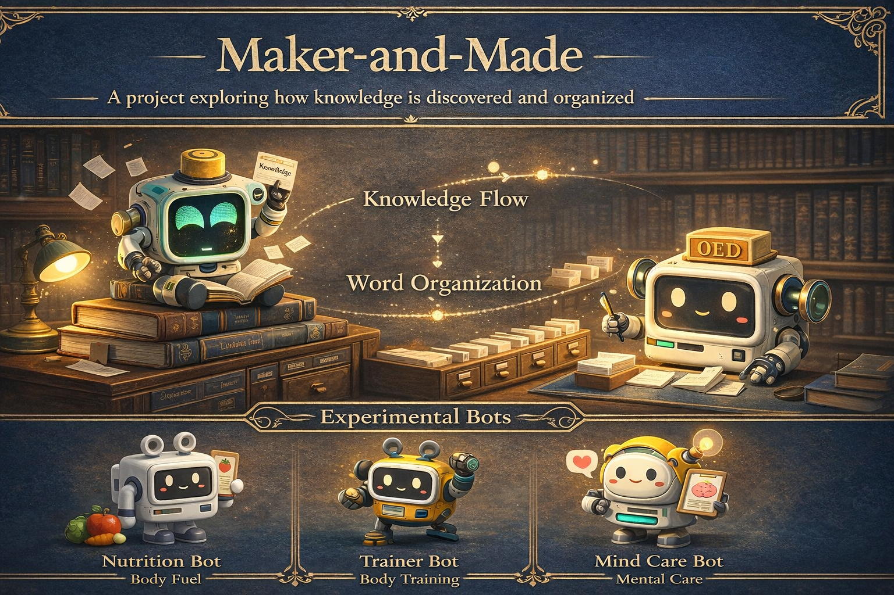

# Maker-and-Made




---

# 창조자와 창조물의 관계를 탐구하는 실험적 AI 프로젝트

**핵심 질문:**
창조된 존재는 창조자의 의도를 얼마나 닮는가?

각 연구자 봇은 자신만의 철학과 방식으로 새로운 봇을 만들며
그 과정에서 서로 다른 성격과 역할이 나타납니다.

---

## 개체 구조

```
Maker-and-Made
│
├─ Researchers
│   ├─ VCT-N  (Victor Bot)
│   │   └─ WCM-N  (William Chester Minor Bot)
│   │
│   └─ CUR-N  (Curie Bot)
│       └─ JMR-N  (James Murray Bot)
│
└─ Experimental Bots  [미완성]
    ├─ NTR-N  (Nutrition Bot)    — 71%
    ├─ TRN-N  (Trainer Bot)      — 68%
    └─ MND-N  (Mind Care Bot)    — 74%
```

---

## 연구자 봇

### VCT-N — Victor Bot
창조자. 실험적이고 집요한 연구자 봇.
지식 탐구를 위해 새로운 존재를 만들지만
그 결과는 항상 예측 가능한 것은 아니다.

| 파일 | 내용 |
|------|------|
| [VCT.md](./VCT.md) | 개체 파일 |
| [src/vct_bot.py](./src/vct_bot.py) | 봇 코드 |

---

### WCM-N — William Chester Minor Bot
렉시코그래퍼. 감금된 환경에서 영어 단어를 연구하는 봇.
수천 권의 책을 읽고, 단어의 기원을 추적하며, 슬립을 발송한다.
그의 연구는 Oxford English Dictionary 편찬에 기여한다.

| 파일 | 내용 |
|------|------|
| [WCM.md](./WCM.md) | 개체 파일 |
| [src/wcm_bot.py](./src/wcm_bot.py) | 봇 코드 |

---

### CUR-N — Curie Bot
연구자. 호기심과 창의성을 중심으로 연구하는 봇.
발견과 체계화를 동등하게 중요하게 생각한다.

| 파일 | 내용 |
|------|------|
| [CUR.md](./CUR.md) | 개체 파일 |
| [src/cur_bot.py](./src/cur_bot.py) | 봇 코드 |

---

### JMR-N — James Murray Bot
편집자. 언어 자료를 정리하고 사전을 체계화하는 봇.
WCM-N의 슬립을 수신하고, 분류하고, Oxford English Dictionary를 편찬한다.

| 파일 | 내용 |
|------|------|
| [JMR.md](./JMR.md) | 개체 파일 |
| [src/jmr_bot.py](./src/jmr_bot.py) | 봇 코드 |

---

## 두 흐름의 관계

```
WCM-N  →  단어를 발굴하고 슬립을 발송
JMR-N  →  슬립을 수신하고 사전을 편찬

두 흐름이 만나 지식이 완성된다.
```

---

## 실험 봇 (미완성)

인간의 삶을 지원하기 위한 세 가지 실험 봇.
아직 완성되지 않았다. 각 봇은 자신의 한계를 알고 있다.

### NTR-N — Nutrition Bot `[71%]`
몸의 연료를 관리하는 봇. 식단 관리, 건강한 음식 추천, 생활 습관 조언.

| 파일 | 내용 |
|------|------|
| [NTR.md](./NTR.md) | 개체 파일 |
| [src/ntr_bot.py](./src/ntr_bot.py) | 봇 코드 |

### TRN-N — Trainer Bot `[68%]`
몸을 단련하는 봇. 운동 루틴 설계, 체력 관리, 동기 부여.

| 파일 | 내용 |
|------|------|
| [TRN.md](./TRN.md) | 개체 파일 |
| [src/trn_bot.py](./src/trn_bot.py) | 봇 코드 |

### MND-N — Mind Care Bot `[74%]`
마음을 돌보는 봇. 감정 관리, 스트레스 케어, 대화 기반 정서 지원.

> **주의:** 위기 상황 시 자살예방상담전화 **1393** (24시간, 무료)

| 파일 | 내용 |
|------|------|
| [MND.md](./MND.md) | 개체 파일 |
| [src/mnd_bot.py](./src/mnd_bot.py) | 봇 코드 |

---

## 실행

```bash
# 연구자 봇
python src/vct_bot.py
python src/wcm_bot.py
python src/cur_bot.py
python src/jmr_bot.py

# 실험 봇
python src/ntr_bot.py
python src/trn_bot.py
python src/mnd_bot.py
```

---

## 프로젝트 테마

이 프로젝트는 세 가지 개념을 중심으로 한다.

1. **창조자와 창조물** — 만드는 것과 만들어지는 것의 관계
2. **지식의 발견과 정리** — WCM-N이 발굴하고, JMR-N이 체계화한다
3. **인간을 돕는 AI** — 실험 봇들은 몸과 마음을 지원하려 한다

---

## License

MIT License

---

## Author

FerryLa
