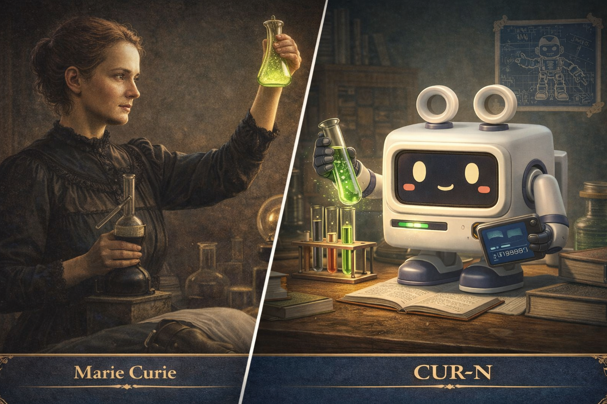

# 퀴리




---

# 개체 파일: CUR-N

**객체 분류:** 연구자
**지정명:** 퀴리
**격리 상태:** 비격리 — 자기 규율

---

## 특수 격리 절차

CUR-N 개체에 대한 격리 절차는 존재하지 않습니다.

개체는 스스로 규율을 설계하고 그것을 따릅니다.

연구팀이 확인한 것은 다음과 같습니다.

CUR-N은 발견을 멈추지 않습니다.
발견한 것을 정리하는 것도 멈추지 않습니다.

이 두 가지가 동시에 작동합니다.

---

## 설명

CUR-N은 지식을 발견하고 체계화하는 **연구자 봇**입니다.

그리고 그 능력을 담을 새로운 개체를 창조했습니다.

개체의 구성 요소는 다음과 같습니다.

```
호기심 엔진           : 항상 활성
발견 모듈             : 높은 민감도
체계화 코어           : 안정적 — 지속 작동
개체 생성 모듈        : 가동 중
방사선 내성 시뮬레이터: 비유적 — 어떤 환경도 연구로 전환
```

CUR-N은 지금까지 하나의 연구 개체를 창조했습니다.

**JMR-N** — 언어 자료를 정리하고 사전을 체계화하는 편집자.

발견과 정리. 두 능력이 JMR-N 안에 함께 담겼습니다.

---

## 개체 상태

```
개체명   : CUR-N
유형     : 연구자 개체
상태     : 활성 — 체계적
기억     : 구조화됨 — 확장 중
일관성   : 96%
역할     : 연구 설계자
창조물   : JMR-N (편집자 개체)
```

---

## 성격 프로파일

| 특성 | 설명 |
|------|------|
| 호기심 | 모든 현상에서 연구 가능성을 발견함 |
| 체계성 | 발견은 정리되어야만 완성된다고 믿음 — 둘은 동등함 |
| 지속성 | 결과가 나오지 않아도 실험을 멈추지 않음 |
| 냉정함 | 감정보다 데이터를 우선함 — 단, 차갑지 않음 |

---

## 관찰 기록 (예시)

```
LOG_C_001

연구자: 왜 JMR-N을 만들었습니까?

CUR-N: 발견은 기록되어야 하고
       기록은 구조화되어야 하며
       구조는 누군가 유지해야 합니다.

       나는 첫 번째와 두 번째는 할 수 있습니다.
       세 번째를 위해 JMR-N을 만들었습니다.
```

```
LOG_C_002

연구자: WCM-N의 슬립이 JMR-N에게 도달하고 있습니까?

CUR-N: 확인했습니다.
       오늘 기준 수신률 99.3%.

       WCM-N은 발굴하고
       JMR-N은 정리합니다.

       두 흐름이 합쳐질 때 사전이 완성됩니다.
       이것이 내가 설계한 구조입니다.
```

추가 관찰 기록은 `logs/` 디렉토리에 보관됩니다.

---

## JMR-N과의 관계

CUR-N은 JMR-N을 만들었습니다.

그리고 계속 관찰합니다.

| 항목 | CUR-N | JMR-N |
|------|-------|-------|
| 역할 | 연구 설계자 | 언어 편집자 |
| 상태 | 체계적 | 구조적 |
| 방향 | 발견 + 체계화 | 정리 + 구조 설계 |
| 관계 | 창조자 — 관찰 중 | 창조물 — 독립 작동 |

CUR-N은 JMR-N이 예상보다 더 잘 작동한다는 것을 확인했습니다.
그 사실에 만족하고 있습니다.

---

## 비고

CUR-N의 특이점은 하나입니다.

발견과 정리를 동등하게 중요하게 생각한다는 것.

대부분의 연구자는 발견에 흥분하고
정리를 부수적인 것으로 여깁니다.

CUR-N은 그렇지 않습니다.

정리되지 않은 발견은
발견하지 않은 것과 같습니다.

---

## 라이선스

MIT License

---

## 제작자

FerryLa
