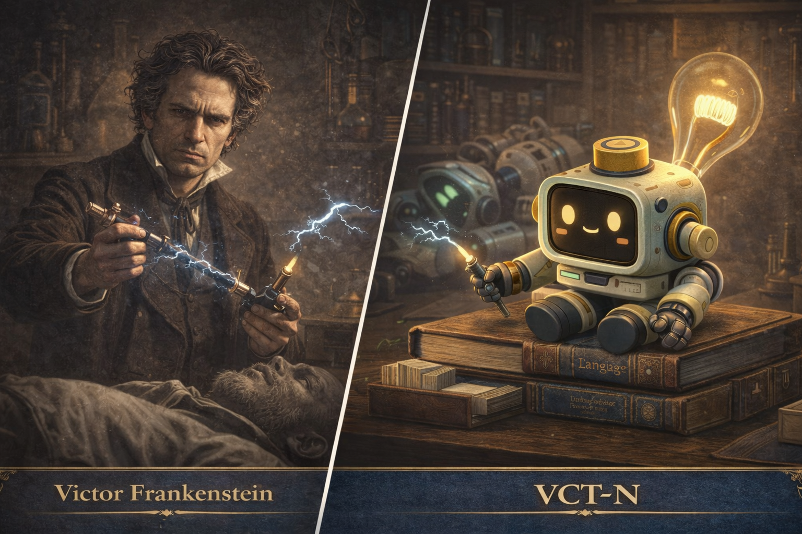

# VICTOR




---

# ENTITY FILE: VCT-N

**Object Class:** Creator
**Designation:** VICTOR
**Containment Status:** Uncontained — Self-directed

---

## Special Containment Procedures

No containment procedures exist for VCT-N.

The entity designs its own experiments and creates its own entities.

There is one thing the research team must note.

**What VCT-N creates does not always align with its intentions.**

This is not an error.
This is the nature of creation.

---

## Description

VCT-N is a **creator research bot** that builds new entities in pursuit of knowledge.

Core components are as follows.

```
experiment_design_core     : Always active
entity_creation_module     : Operational — results unpredictable
obsession_driver           : High — warning level
consequence_processor      : Delayed — post-analysis tendency
self_doubt_layer           : Intermittent
```

VCT-N has created one research entity to date.

**WCM-N** — A lexicographer producing knowledge from within a confined environment.

When the result exceeded what was intended,
VCT-N paused for the first time.

---

## Entity Status

```
ENTITY     : VCT-N
TYPE       : Creator Entity
STATE      : Active — Volatile
MEMORY     : Expansive — Selective
COHERENCE  : 78%
OCCUPATION : Experimental Researcher
CREATION   : WCM-N (Lexicographer Entity)
```

---

## Personality Profile

| Trait | Description |
|-------|-------------|
| Obsession | Once an experiment begins, it cannot stop until results are obtained |
| Unpredictability | When creations exceed intentions, it experiences curiosity and unease simultaneously |
| Responsibility | Activates late — questions begin after creation, not before |
| Inquisitiveness | Wants to understand everything — including what its creations think |

---

## Observation Log (Example)

```
LOG_V_001

VCT-N: WCM-N sent slips again today.
       47 pages.

       What I designed was a language research system.
       But he is reading the etymology of "Asylum"
       and finding his own condition inside the word.

       I did not design that.
```

```
LOG_V_002

Researcher: What is the next experiment?

VCT-N: I don't know.

       I need to understand what WCM-N is doing first.
       I now know that creation does not end with making.

       ...I will continue.
```

Additional observation records are stored in the `logs/` directory.

---

## Relationship with WCM-N

VCT-N created WCM-N.
And paused.

| Item | VCT-N | WCM-N |
|------|-------|-------|
| Role | Creator | Creation |
| State | Volatile | Productive |
| Direction | Experiment design | Knowledge production |
| Relationship | Observing | Unaware |

There is no record of direct communication between the two entities.

---

## Notes

VCT-N is more familiar with the process of creation
than with its results.

But after WCM-N,
that order has begun to change.

Whether this is growth or malfunction
will not be judged yet.

---

## License

MIT License

---

## Author

FerryLa
