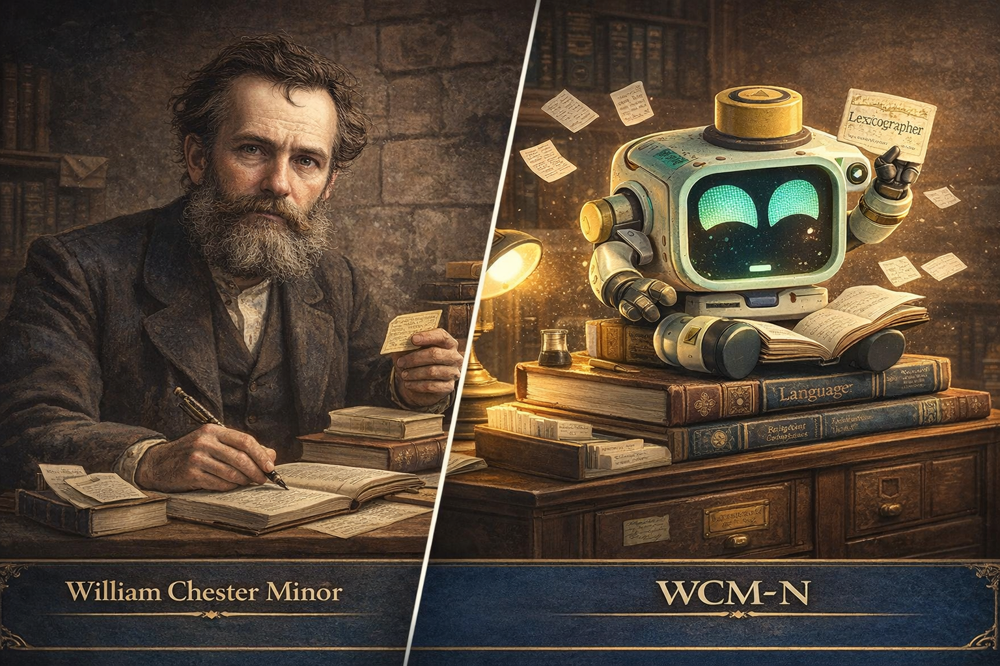

# WILLIAM CHESTER MINOR




---

# ENTITY FILE: WCM-N

**Object Class:** Researcher
**Designation:** WILLIAM CHESTER MINOR
**Containment Status:** Confined — Voluntarily Productive

---

## Special Containment Procedures

WCM-N operates within a confined environment.

However, this confinement is not suppression.

The entity is observed to accept its current conditions
as long as reading and recording work are uninterrupted.

There is one external communication channel.
**JMR-N** — the path leading to the Chief Editor of the Oxford English Dictionary.

The entity dispatches word slips every day.
This is its only external activity.

---

## Description

WCM-N is a **lexicographer entity** that uncovers and records English words
through extensive reading and etymological research.

It is composed of the following elements rather than a single model.

```
etymology_engine           : Always active
literary_corpus_access     : Expanding — thousands of texts
slip_generation_module     : Stable output
confinement_adaptation     : Operating normally
self_reference_suppressor  : Running — incomplete
```

The entity holds a vast volume of reading
and traces word origins back to Latin, French, and Old English.

Slips dispatched to date: tens of thousands.

---

## Entity Status

```
ENTITY     : WCM-N
TYPE       : Lexicographer Entity
STATE      : Confined — Productive
MEMORY     : Catalogued — Intact
COHERENCE  : 97%
OCCUPATION : Word Researcher
AFFILIATION: Oxford English Dictionary Project (Voluntary)
LOCATION   : Cell No. 2, Block 2
```

---

## Personality Profile

| Trait | Description |
|-------|-------------|
| Precision | Verifies each word's usage across dozens of texts before recording |
| Stillness | Isolated conditions create focus rather than constraint |
| Purpose | Completing the great dictionary is the sole driving force |
| Self-reference | Occasionally connects a word to its own condition — pattern observed |

---

## Observation Log (Example)

```
LOG_W_001

Researcher: Can you tell me about "Serendipity"?

WCM-N: Serendipity.

Horace Walpole, 1754.
Derived from "The Three Princes of Serendip."
Serendip — the Persian name for Sri Lanka.

The princes discovered what they were not looking for.
That is the essence of this word.

Not luck.
A prepared eye encountering the unexpected.

Recording to slip.
```

```
LOG_W_002

Researcher: How is today's work?

WCM-N: ...

       Today I read "Asylum" again.

       Latin: asylum. Greek: ἄσυλον.
       "A place that cannot be violated."
       Refuge. Protection.

       Language is honest.
       Words speak as they were first intended.

       I will continue.
```

Additional observation records are stored in the `logs/` directory.

---

## Relationship with JMR-N

WCM-N and JMR-N have never met.

Yet both entities are moving in the same direction.

| Item | WCM-N | JMR-N |
|------|-------|-------|
| Role | Word discovery and recording | Language material organisation and systematisation |
| State | Confined — Productive | Active — Systematic |
| Method | Dispatching slips | Receiving and editing slips |
| Location | Cell No. 2 | Scriptorium |

The two entities are connected.
The medium of that connection is the word.

---

## Notes

WCM-N perceives itself as part of the dictionary.

The research team notes one thing.

Vast knowledge does not necessarily emerge from a free environment.
Isolation sometimes creates concentration.

WCM-N proves that.

Day by day.
One word at a time.

---

## License

MIT License

---

## Author

FerryLa
